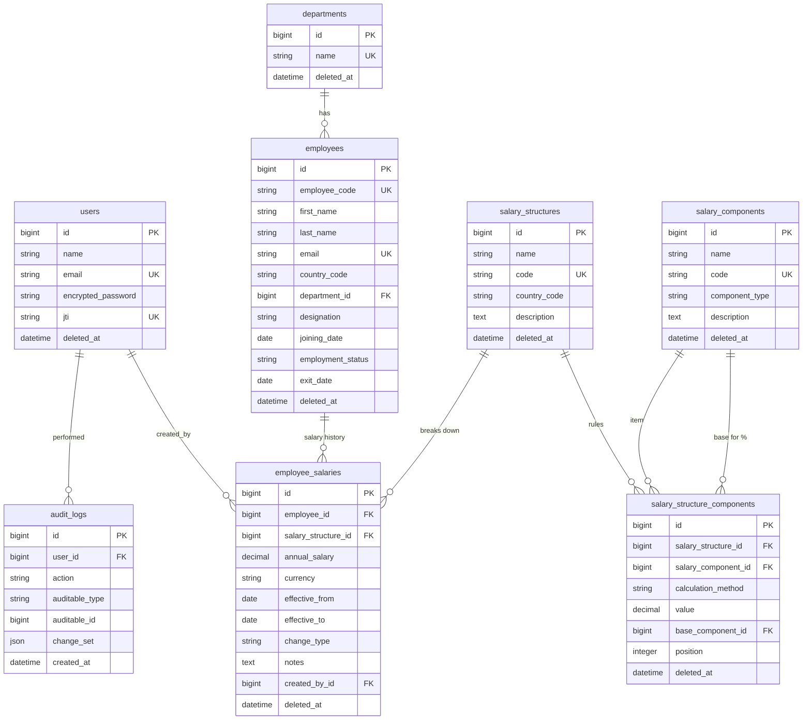

# Database Design

MySQL 8+, managed through Rails migrations. This document is the source of truth for the schema; migrations should match it.

## Principles

- **Current data and history are separate.** An employee's salary is never overwritten. Every change is a new row with an effective date.
- **Soft delete everywhere.** Business tables have a `deleted_at` column (`NULL` = live). A shared `SoftDeletable` concern provides a `kept` scope, `soft_delete!` and `restore!`. We don't use `default_scope`, because it silently changes every query; queries say `.kept` explicitly.
- **Soft delete is not the same as "terminated".** A terminated employee is a real person who used to work here, so they stay in history and insights. Soft delete is only for records that should not exist, such as an employee created by mistake.
- **Money is `decimal(15,2)`, rates are `decimal(15,4)`. Never float.**
- **Rules are enforced twice.** Model validations give friendly errors. Database constraints (NOT NULL, foreign keys, unique indexes, check constraints) guarantee integrity even if something bypasses the model.
- **Enums are strings** (`"active"`, not `1`), backed by a check constraint that limits them to allowed values.
- **Every table** has a `bigint` `id` and `created_at` / `updated_at`, except `audit_logs`, which has no `updated_at` because it is never updated.

### Partial unique indexes in MySQL

MySQL has no partial indexes (PostgreSQL's `WHERE deleted_at IS NULL`). Where uniqueness must ignore soft-deleted rows, we add a **generated column** that MySQL computes itself. It is `NULL` for rows to ignore. We then put a unique index on it; unique indexes allow any number of NULLs, so ignored rows never collide.

We use this only where it's genuinely needed, in four places across two tables. Everywhere else a plain unique index is simpler, and also correct: if a deleted record holds a name or code, the right action is to restore it, not create a duplicate.

## Entity relationship diagram

## 1. users

HR Managers who sign in. This is separate from `employees` because the person managing salaries and the people being paid are different things.

| Column | Type | Null | Why |
|---|---|---|---|
| `name` | string | no | Shown in the UI and audit log |
| `email` | string | no | Login identifier |
| `encrypted_password` | string | no | bcrypt hash (Devise) |
| `jti` | string | no | JWT ID (devise-jwt). Regenerated on sign-out, so old tokens die without a denylist table |
| `deleted_at` | datetime | yes | Deactivate a user while keeping their audit history |

- **Indexes:** `email` unique, `jti` unique.
- **Devise modules:** `database_authenticatable`, `validatable`, `jwt_authenticatable`. No password reset (needs email delivery), remember-me or tracking.
- **No `role` column:** there is one persona. It will be added when a second role exists.
- **Associations:** `has_many :employee_salaries, foreign_key: :created_by_id`; `has_many :audit_logs`.

## 2. departments

A list HR manages. It's a table, not a text field, so renames are a single update and insights group by a stable id.

| Column | Type | Null | Why |
|---|---|---|---|
| `name` | string | no | Display and filtering |
| `deleted_at` | datetime | yes | Retire without breaking history |

- **Indexes:** `name` unique. A deleted department is restored rather than recreated.
- **Associations:** `has_many :employees, dependent: :restrict_with_error`. A department with employees can't be deleted.

## 3. employees

The person being paid. **No salary amounts here**; those live in `employee_salaries`.

| Column | Type | Null | Why |
|---|---|---|---|
| `employee_code` | string | no | The ID HR uses (`EMP00042`). Stable and never reused |
| `first_name`, `last_name` | string | no | Display and search |
| `email` | string | no | Work email. Not a login |
| `country_code` | string(2) | no | ISO code. Default currency and "by country" insights. Validated against a supported list in config |
| `department_id` | bigint FK | no | Department |
| `designation` | string | no | Job title, for "pay by role" insights. Text, not a table, until pay bands exist |
| `joining_date` | date | no | Tenure; first salary can't start before it |
| `employment_status` | string enum | no | `active` (default), `on_leave`, `terminated` |
| `exit_date` | date | yes | Required if and only if terminated. Makes "headcount on a date" answerable |
| `deleted_at` | datetime | yes | Only for records created by mistake |

- **Indexes:** `employee_code` unique; `email` unique; `department_id`; `country_code`; `employment_status`; `designation`; `first_name`; `last_name`. Search uses prefix matching (`LIKE 'rah%'`), which can use these indexes.
- **Checks:** status in allowed values; `exit_date >= joining_date`.
- **Associations:** `belongs_to :department`; `has_many :employee_salaries`; `has_one :current_salary` (the live salary as of today, so lists can `includes(:current_salary)` without N+1); `has_many :audit_logs, as: :auditable`.

## 4. salary_components

The catalogue of pay items (Basic, HRA, Special Allowance, PF, Insurance, Income Tax). It says *what* an item is, not how much.

| Column | Type | Null | Why |
|---|---|---|---|
| `name` | string | no | Display |
| `code` | string | no | Short stable identifier (`PF`). Used in compact views, seeds, tests and future payslips |
| `component_type` | string enum | no | `earning` or `deduction` |
| `description` | text | yes | Explanation for HR |
| `deleted_at` | datetime | yes | Retire an item |

- **Indexes:** `code` unique. **Checks:** type in allowed values.
- **Associations:** `has_many :salary_structure_components, dependent: :restrict_with_error`.

## 5. salary_structures

A reusable template ("India Standard"). Many employees share one, so a rule changes in one place.

| Column | Type | Null | Why |
|---|---|---|---|
| `name` | string | no | Display |
| `code` | string | no | Stable identifier (`IN_STD`) |
| `country_code` | string(2) | yes | If set, it can only be assigned to employees in that country, because fixed amounts only make sense in that currency. Empty means percentage-only and usable anywhere |
| `description` | text | yes | Who it's for |
| `deleted_at` | datetime | yes | Retire a structure |

- **Indexes:** `code` unique; `country_code`.
- **Associations:** `has_many :salary_structure_components, -> { kept.order(:position) }`; `has_many :salary_components, through: :salary_structure_components`; `has_many :employee_salaries, dependent: :restrict_with_error`.

## 6. salary_structure_components

How each item is calculated within a structure.

| Column | Type | Null | Why |
|---|---|---|---|
| `salary_structure_id` | bigint FK | no | Which structure |
| `salary_component_id` | bigint FK | no | Which item |
| `calculation_method` | string enum | no | `fixed`, `percentage_of_gross`, `percentage_of_component`, `remainder` |
| `value` | decimal(15,4) | yes | Monthly amount for `fixed`, percent for percentage methods, empty for `remainder` |
| `base_component_id` | bigint FK | yes | For `percentage_of_component` only: what it's a percentage of |
| `position` | integer | no | Calculation and display order. Can only reference an earlier position, so there are no circular rules |
| `deleted_at` | datetime | yes | Rules removed from a structure stay visible as history |

| calculation_method | Meaning | Example |
|---|---|---|
| `fixed` | Fixed monthly amount | Insurance = 500 |
| `percentage_of_gross` | % of monthly gross | Basic = 50% of gross |
| `percentage_of_component` | % of an earlier component | PF = 12% of Basic |
| `remainder` | Earnings only: whatever is left so earnings equal gross exactly | Special Allowance |

- **Generated columns and unique indexes (partial-index style):**
  - `live_component_id` = component id if live, else `NULL`; **unique `(salary_structure_id, live_component_id)`**. An item appears once per structure, and it can be re-added after removal.
  - `live_position` = position if live, else `NULL`; **unique `(salary_structure_id, live_position)`**. There's no ambiguous ordering.
- **Indexes:** `salary_component_id`, `base_component_id`.
- **Checks:** `value >= 0`; method in allowed values.
- **Validations:** `value` required unless `remainder`; percentages ≤ 100; `base_component` required if and only if `percentage_of_component`, and it must be at an earlier position in the same structure; at most one `remainder` per structure, and only for an earning.
- **Associations:** `belongs_to :salary_structure`; `belongs_to :salary_component`; `belongs_to :base_component, class_name: "SalaryComponent", optional: true`.

## 7. employee_salaries

Salary history: one row per salary period per employee. A change adds a row and closes the previous one, in a single transaction (`Salaries::ChangeService`).

| Column | Type | Null | Why |
|---|---|---|---|
| `employee_id` | bigint FK | no | Whose salary |
| `salary_structure_id` | bigint FK | no | How it breaks down |
| `annual_salary` | decimal(15,2) | no | **Annual gross**, the source of truth. Monthly gross = ÷ 12 |
| `currency` | string(3) | no | ISO code, defaulted from country. Stored, never converted |
| `effective_from` | date | no | First day it applies |
| `effective_to` | date | yes | Last day it applies; `NULL` = current |
| `change_type` | string enum | no | `joining`, `increment`, `promotion`, `adjustment`, `correction`. Makes "promotions this year" a simple group-by |
| `notes` | text | yes | HR's explanation |
| `created_by_id` | bigint FK | no | Who entered it |
| `deleted_at` | datetime | yes | Undo a mistaken entry; the service reopens the previous period |

- **Generated columns and unique indexes (partial-index style):**
  - `live_effective_from` = `effective_from` if live, else `NULL`; **unique `(employee_id, live_effective_from)`**. One start date per employee, so a deleted mistake doesn't block re-entering the same date.
  - `open_marker` = `1` if live and `effective_to IS NULL`, else `NULL`; **unique `(employee_id, open_marker)`**. At most one current salary per employee, guaranteed by the database.
- **Indexes:** `(employee_id, effective_to)`; `(effective_from, effective_to)` for "everyone's salary as of today" and recent changes (its leading column covers `effective_from` queries, so no separate index); `salary_structure_id`; `created_by_id`.
- **Checks:** `annual_salary > 0`; `effective_to IS NULL OR effective_to >= effective_from`; `change_type` in allowed values.
- **Enforced in the service, not the database:** no overlapping date ranges per employee. MySQL can't express this as a constraint; tests cover it.
- **Validations:** required fields; currency in the supported list; `effective_from >= employee.joining_date`; if the structure has a country, it must match the employee's.
- **Associations and scopes:** `belongs_to :employee`, `:salary_structure`, `:created_by` (User); `scope :as_of, ->(date) { where(effective_from: ..date).where(effective_to: [nil, date..]) }`; `scope :current, -> { as_of(Date.current) }`.

## 8. audit_logs

An append-only trail of sensitive actions. Never updated or deleted. Written explicitly by services through `Audit::Logger`, not by model callbacks.

| Column | Type | Null | Why |
|---|---|---|---|
| `user_id` | bigint FK | no | Who |
| `action` | string | no | `created`, `updated`, `deleted`, `restored` |
| `auditable_type`, `auditable_id` | string, bigint | no | Which record (polymorphic) |
| `change_set` | json | no | Before and after values, e.g. `{"annual_salary": [900000, 1080000]}` |
| `created_at` | datetime | no | When |

- **Indexes:** `(auditable_type, auditable_id)`; `user_id`; `created_at`.
- **Associations:** `belongs_to :user`; `belongs_to :auditable, polymorphic: true`.

## Deliberately not in the schema (yet)

| Not included | Why | How it would be added |
|---|---|---|
| Payroll runs and payslips | Out of MVP scope | New `payroll_runs`, `employee_payrolls`, `payroll_items` tables reading from salary structures |
| Unpaid days, proration | Belong to payroll | A payroll input, and `paid_days / days_in_month` applied in the calculator |
| Holidays and attendance | Nothing in the MVP consumes them | New tables alongside payroll |
| Statutory PF and tax slabs | Simple configurable percentages for now | New calculation methods (`slab`, `percentage_with_cap`) plus a slabs table |
| `countries`, `exchange_rates` | No conversion in MVP | New tables; `country_code` and `currency` already fit |
| `roles` | One persona | A `role` column on users |
| `designations`, pay bands | Not required yet | New table; `designation` text migrates into it |
