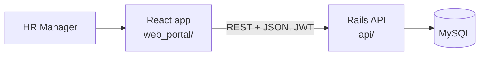
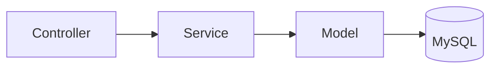

# Design Notes

How the system is put together, and why. The schema is covered in [database.md](database.md). Scope is covered in [requirements.md](requirements.md).

## Architecture



The app is a single Rails application serving a JSON API, with a separate React frontend. For 10,000 employees and one type of user, this is all we need. Microservices, message queues, caches or search engines would add operational cost without solving any problem we have. If something becomes slow later, we'll measure it first and fix that specific thing.

## Inside the Rails API

Requests flow in one direction only:



- **Controllers** read params, check authentication, call a service or a simple query, and render JSON. That's all.
- **Services** hold every piece of business logic: salary calculation, salary changes, insights and audit logging. Each service does one job and is easy to unit test.
- **Models** declare associations, validations, enums and scopes. They don't do heavy processing and don't have callbacks with side effects.

Proposed folder layout:

```
api/app/
  controllers/api/v1/   employees, salaries, salary_structures, insights, filters, ...
  services/
    salaries/           calculator.rb, change_service.rb
    insights/           summary.rb, by_country.rb, distribution.rb, ...
    audit/              logger.rb
  models/               employee, employee_salary, salary_structure, ...
  serializers/          one per resource, plus "lite" variants for lists
```

## Error handling

Errors are never swallowed. Our code doesn't `rescue` anything. Expected failures raise, and a single base concern (`ErrorHandling`, included in `ApplicationController`) turns them into consistent JSON responses:

| Error | HTTP status |
|---|---|
| Missing or invalid token (Devise) | 401 |
| `ActiveRecord::RecordNotFound` | 404 |
| `ActionController::ParameterMissing` | 400 |
| `ActiveRecord::RecordInvalid` | 422, with field errors in `details` |
| `ApplicationError` subclasses (domain rules, e.g. overlapping salary periods) | Their own declared status |

Every handled error is logged as a warning, so expected failures are still visible.

**Unexpected errors (bugs)** are caught only by a final fallback in the same concern, which never hides them:
1. It logs the error class, message and full backtrace at error level.
2. It reports the error through `Rails.error.report`, the hook any error tracker (Sentry, Rollbar…) subscribes to.
3. It responds with a generic `500 { "error": "Something went wrong", "code": "internal_server_error" }`, so no stack traces or SQL leak to the client.

Services, models and controller actions never `rescue`; errors always travel up to this one place.

All error responses have the same shape, compatible with Devise's own 401 body, so the React app reads `error` the same way everywhere:

```json
{ "error": "Validation failed: Name can't be blank", "code": "record_invalid", "details": { "name": ["can't be blank"] } }
```

## API sketch

All endpoints sit under `/api/v1` and require a signed-in HR user, except sign-in itself.

| Area | Endpoints |
|---|---|
| Auth | `POST /auth/sign_in`, `DELETE /auth/sign_out` |
| Employees | `GET /employees` (paginated, search and filters, lite columns), `GET/POST/PATCH/DELETE /employees/:id` (delete = soft delete) |
| Salaries | `GET /employees/:id/salaries` (history), `POST /employees/:id/salaries` (salary change), `GET /employees/:id/salary_breakdown?on=date` |
| Structures | `GET/POST/PATCH/DELETE /salary_structures` (components nested), `GET /salary_components` |
| Filters | `GET /filters`: departments (id, name), countries, designations and statuses in one small payload for dropdowns |
| Insights | `GET /insights/summary`, `/insights/by_country`, `/insights/by_department?country=`, `/insights/distribution?country=`, `/insights/recent_changes` |

**Lite APIs:** list endpoints return only the columns the table on screen shows. Full records come from the detail endpoint. The filters endpoint exists so the UI never downloads the employee table just to fill a dropdown.

## How salary calculation works

One service, `Salaries::Calculator`, takes an employee salary and its structure and returns the monthly breakdown. It does no database writes, which makes it fast and simple to test.

1. Monthly gross = annual salary / 12.
2. Earnings are calculated in `position` order. Each is fixed, a percentage of gross, or a percentage of an earlier component. The `remainder` earning takes whatever is left, so earnings always add up to gross exactly.
3. Deductions are calculated the same way.
4. Net = gross − total deductions.

Amounts are rounded to 2 decimal places, half up, at each component. The remainder component absorbs any rounding difference, so totals never drift by a paisa.

The breakdown is the **standard monthly salary**, not an actual month's payout. Unpaid leave and partial months belong to payroll, which is out of scope.

## Known limitations

- **Structure changes apply to past periods.** The breakdown is calculated on demand from the structure's current rules. If HR changes PF from 12% to 10%, the breakdown shown for an old salary period also uses 10%. The annual salary history itself is never affected. A future payroll module would store a snapshot of each month's calculated breakdown, which fixes this for paid months. The audit log already records every rule change in the meantime.
- **No cross-currency totals.** Figures are grouped by currency and never converted.
- **Tax and PF are simplified** configurable percentages, not statutory calculations.

## Key decisions and trade-offs

| Decision | Why | Trade-off we accept |
|---|---|---|
| Rails API + React, single repo | Matches the brief; one place for code, docs and history | Two apps to deploy |
| MySQL | Relational data with strong consistency needs; well supported by Rails | No partial indexes or exclusion constraints, so some rules live in services with tests |
| Salary history via effective dates | Pay history is the core of "how do we pay people"; never lose data | Queries need a date condition to find the current salary |
| Configurable salary structures | Rules like the PF rate change without code changes | Slightly more setup than a single salary column |
| Currency stored, never converted | Every number shown is truthful; this is how real HR tools store pay | No single org-wide total across countries |
| Devise + devise-jwt | Proven, secure authentication without writing our own | An extra gem dependency |
| Soft delete | Salary data is sensitive and must stay auditable | Every query must exclude deleted rows, handled through scopes |
| No background jobs | Nothing in MVP is slow enough to need them | Revisit if payroll runs are added |

## Performance at 10,000 employees

10,000 rows is small for MySQL. The risk isn't data volume but wasteful queries, so we'll guard against that:

- **No N+1 queries:** list endpoints `includes` their associations, and request specs check query counts on key endpoints.
- **Aggregates run in the database:** counts, sums, averages, minimums and maximums use `group` / `sum` / `average`, not Ruby loops.
- **Median:** MySQL has no `MEDIAN` function, and the rule book bans raw SQL, so we pluck the sorted salaries for one group and take the middle value. For a few thousand decimals that's milliseconds. Reconsider if the dataset grows 100×.
- **Pagination on every list**, and selecting only the columns we need.
- **Indexes** on every filter and join column (listed in database.md). After seeding 10,000 employees we'll check slow queries with `EXPLAIN` and add indexes only where measurements justify them.
- **Seeding** uses `insert_all` in batches and a fixed random seed, so it's fast and every run produces the same data.

## Testing strategy

Tests are written first, after listing edge cases. RSpec and FactoryBot.

- **Calculator (unit):** each calculation method, remainder and rounding, a zero salary, a missing base component, a structure with no earnings.
- **Salary change service:** closes the previous period, rejects overlapping or backdated changes, future-dated raises, audit log written, everything rolled back on failure.
- **Insights:** correct figures on a small known dataset; soft-deleted and terminated employees handled as specified; grouping by currency.
- **Requests:** authentication required, filters and pagination work, lite payload shape, soft delete hides records, no N+1 queries.

Tests use small, explicit fixtures and no randomness, so they stay fast and deterministic.
